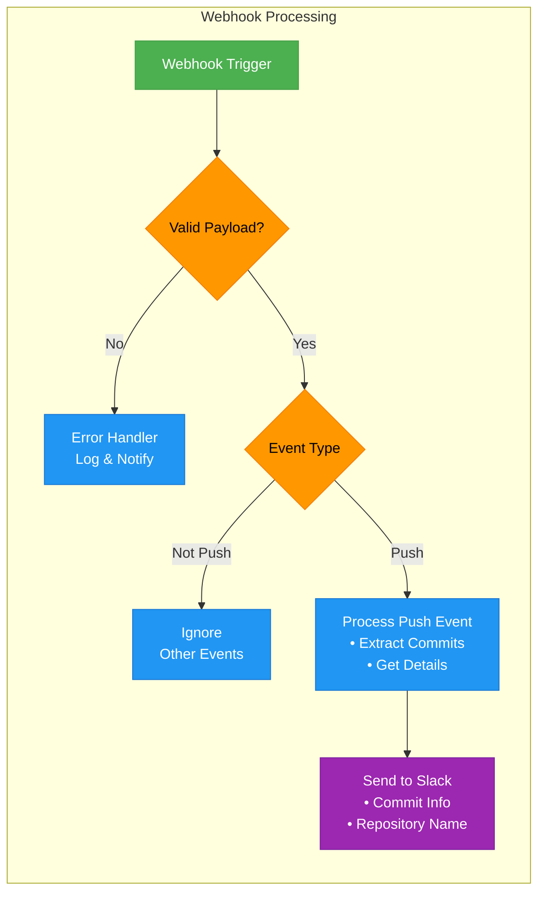

Let me provide a practical example of an n8n workflow using a Webhook trigger node. This workflow will demonstrate a common use case: processing incoming webhooks from GitHub repositories.

###  Workflow Overview

The workflow will:

1. Receive repository events via webhook
2. Filter for push events
3. Extract commit information
4. Send notifications to Slack





The diagram uses color coding to represent different types of nodes:

- Green: Trigger node (where the workflow starts)
- Orange: Decision points (conditional logic)
- Blue: Processing nodes (data transformation)
- Purple: Output nodes (external communication)

###  Implementation Steps

Create the Webhook Trigger Node```json
{
  "nodes": [
    {
      "parameters": {},
      "name": "Webhook",
      "type": "n8n-nodes-base.webhook",
      "typeVersion": 1,
      "position": [230, 300],
      "webhookId": "github-webhook"
    }
  ]
}
```

Add Validation Logic```json
{
  "nodes": [
    {
      "parameters": {
        "conditions": {
          "boolean": [
            {
              "input": "=($json['action'] === 'push')",
              "inputParameters": {
                "json": "={{$node['Webhook'].json}}"
              }
            }
          ]
        }
      },
      "name": "Push Event Filter",
      "type": "n8n-nodes-base.if",
      "typeVersion": 1,
      "position": [450, 300]
    }
  ]
}
```

Process Push Events```json
{
  "nodes": [
    {
      "parameters": {
        "keepOnlyFields": true,
        "values": {
          "string": [
            "=github.repository.name",
            "=github.commits[0].message",
            "=github.commits[0].author.name"
          ]
        }
      },
      "name": "Extract Data",
      "type": "n8n-nodes-base.set",
      "typeVersion": 1,
      "position": [670, 300]
    }
  ]
}
```

Send Slack Notification```json
{
  "nodes": [
    {
      "parameters": {
        "channel": "#github-notifications",
        "message": "=Repository: {{$node['Extract Data'].json['github.repository.name']}}\nCommit Message: {{$node['Extract Data'].json['github.commits[0].message']}}\nAuthor: {{$node['Extract Data'].json['github.commits[0].author.name']}}"
      },
      "name": "Slack",
      "type": "n8n-nodes-base.slack",
      "typeVersion": 1,
      "position": [890, 300],
      "credentials": {
        "slackApi": "your-slack-api-credentials"
      }
    }
  ]
}
```

###  Complete Workflow JSON

```json
{
  "nodes": [
    {
      "parameters": {},
      "name": "Webhook",
      "type": "n8n-nodes-base.webhook",
      "typeVersion": 1,
      "position": [230, 300],
      "webhookId": "github-webhook"
    },
    {
      "parameters": {
        "conditions": {
          "boolean": [
            {
              "input": "=($json['action'] === 'push')",
              "inputParameters": {
                "json": "={{$node['Webhook'].json}}"
              }
            }
          ]
        }
      },
      "name": "Push Event Filter",
      "type": "n8n-nodes-base.if",
      "typeVersion": 1,
      "position": [450, 300]
    },
    {
      "parameters": {
        "keepOnlyFields": true,
        "values": {
          "string": [
            "=github.repository.name",
            "=github.commits[0].message",
            "=github.commits[0].author.name"
          ]
        }
      },
      "name": "Extract Data",
      "type": "n8n-nodes-base.set",
      "typeVersion": 1,
      "position": [670, 300]
    },
    {
      "parameters": {
        "channel": "#github-notifications",
        "message": "=Repository: {{$node['Extract Data'].json['github.repository.name']}}\nCommit Message: {{$node['Extract Data'].json['github.commits[0].message']}}\nAuthor: {{$node['Extract Data'].json['github.commits[0].author.name']}}"
      },
      "name": "Slack",
      "type": "n8n-nodes-base.slack",
      "typeVersion": 1,
      "position": [890, 300],
      "credentials": {
        "slackApi": "your-slack-api-credentials"
      }
    }
  ],
  "connections": {
    "Webhook": {
      "main": [["Push Event Filter"]]
    },
    "Push Event Filter": {
      "main": [["Extract Data"]]
    },
    "Extract Data": {
      "main": [["Slack"]]
    }
  }
}
```

###  Setup Instructions

Import the workflow JSON into n8n2:11Configure your webhook endpoint URL- Go to GitHub repository → Settings → Webhooks
- Enter your n8n webhook URL (provided in the node settings)
- Set content type to 'application/json'
- Select 'push events' under 'Which events would you like to trigger this webhook?'

Add your Slack API credentials- Create a new credential in n8n
- Replace 'your-slack-api-credentials' with your actual credential name

###  Error Handling Best Practices

As recommended in 2:8, implement these error handling strategies:

1. Add retry logic for API calls
2. Validate incoming webhook data
3. Log errors for debugging
4. Set up notifications for failures

This workflow demonstrates key concepts of n8n automation including:

- Webhook processing
- Conditional logic
- Data transformation
- External API integration
- Error handling

You can extend this basic structure to handle other GitHub events or integrate with different services based on your needs.q